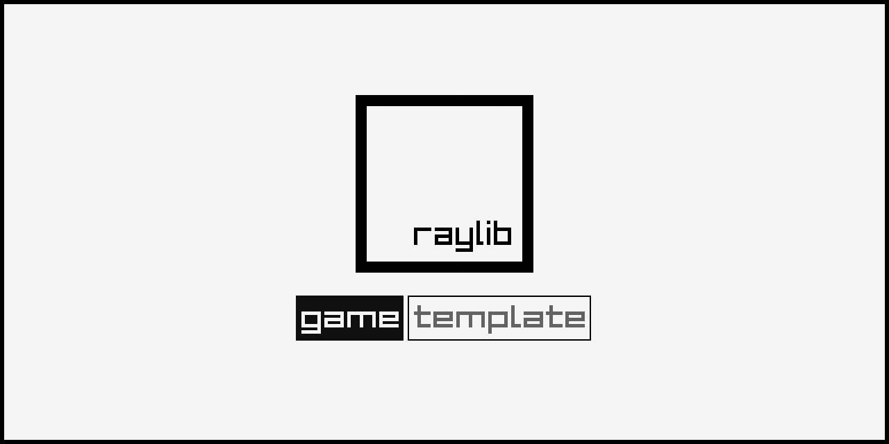

## Descent

### Description

$(Your Game Description)

### Features

 - $(Game Feature 01)
 - $(Game Feature 02)
 - $(Game Feature 03)

### Controls

Keyboard:
 - $(Game Control 01)
 - $(Game Control 02)
 - $(Game Control 03)

### Screenshots

_TODO: Show your game to the world, animated GIFs recommended!._

### Building

- After cloning this repository `descent` should exist in the same directory as `raylib` itself.  So your file structure should look like this:
    - Some parent directory
        - `raylib`
            - the contents of https://github.com/raysan5/raylib
        - `descent`
            - this `README.md` and all other descent files
- If using Visual Studio, open projects/VS2022/descent.sln
- Select on `descent` in the solution explorer, then in the toolbar at the top, click `Project` > `Set as Startup Project`
- Now you're all set up!  Click `Local Windows Debugger` with the green play arrow and the project will run.

### Developers

 - $(Developer 01) - $(Role/Tasks Developed)
 - $(Developer 02) - $(Role/Tasks Developed)
 - $(Developer 03) - $(Role/Tasks Developed)

### Links

 - YouTube Gameplay: $(YouTube Link)
 - itch.io Release: $(itch.io Game Page)
 - Steam Release: $(Steam Game Page)

### License

This game sources are licensed under an unmodified zlib/libpng license, which is an OSI-certified, BSD-like license that allows static linking with closed source software. Check [LICENSE](LICENSE) for further details.

$(Additional Licenses)

*Copyright (c) $(Year) $(User Name) ($(User Twitter/GitHub Name))*
